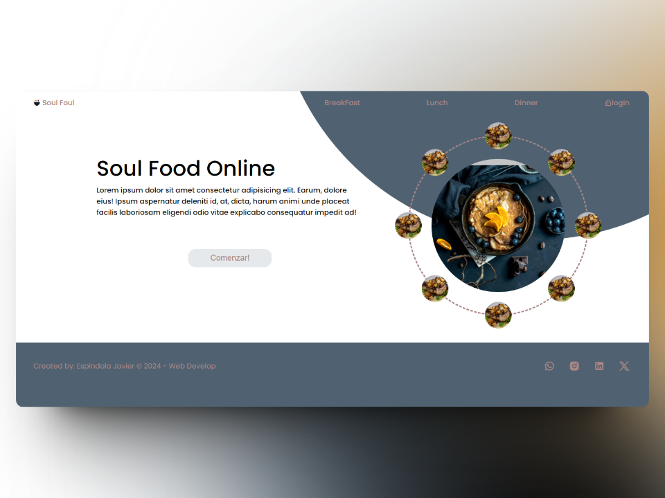

# Tienda de Comida Online

Este es el repositorio de un ejemplo de Tienda de Comida Online, un proyecto que permite a los usuarios realizar pedidos de comida desde la comodidad de su hogar. solo esta el home se copio de un modelo en figma.

## link del Proyecto

- [link pagina](https://micolash89.github.io/Soul-Food-Online/) - Deploy en github Pages
- [FIGMA](<https://www.figma.com/file/8nPqZxLCUQuZpvUqvXHwQN/Food-animation-webpage-design-(Community)-(Copy)?type=design&node-id=2-2&mode=design&t=zJfJHvYMZ2jSYaER-0>) - Diseñador

## Tecnologías Utilizadas

- HTML/CSS

## Captura de pantalla

    

